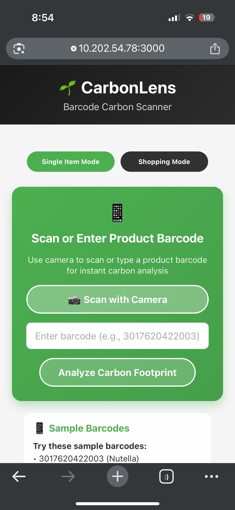
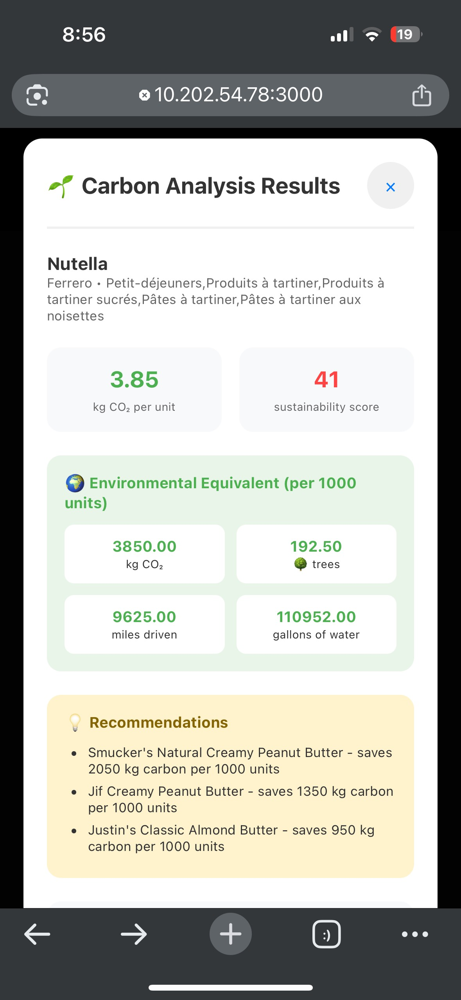
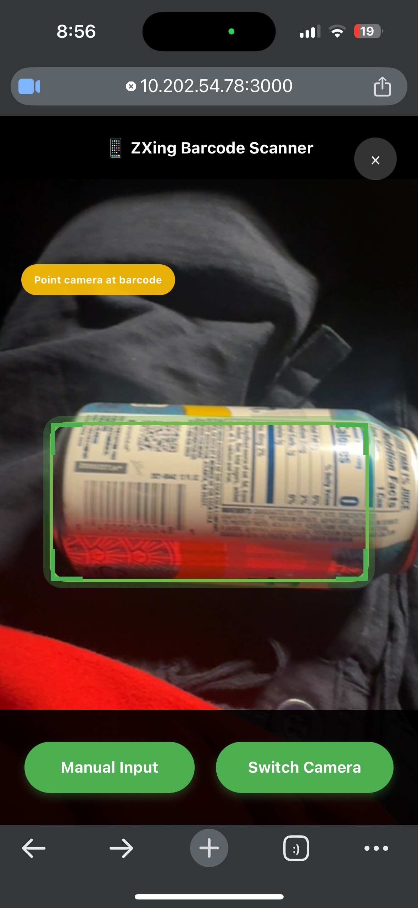
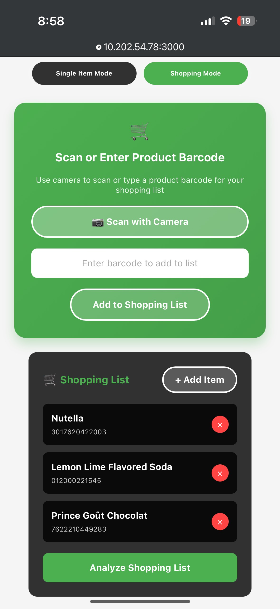
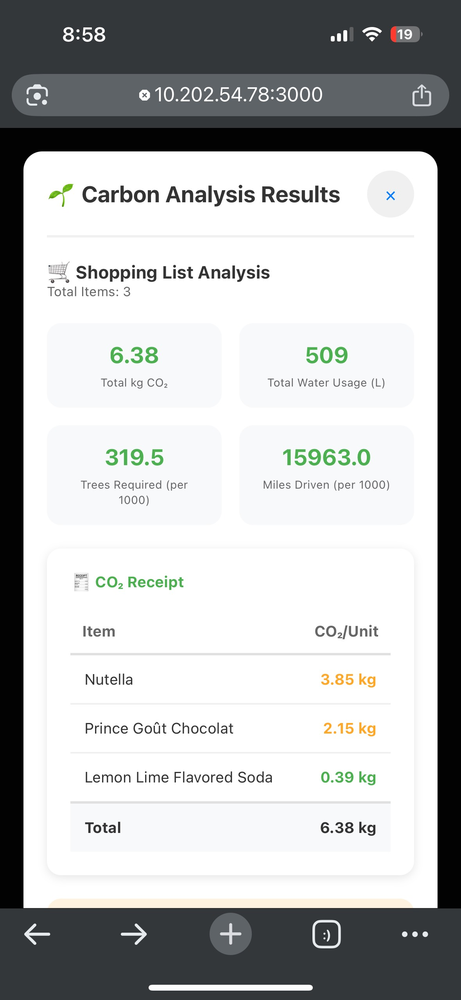

# 🏆 Winner of MLH Track: Best Use of MongoDB Atlas at GirlHacks 2025

# 🌱 CarbonLens: Sustainable Shopping in AR  

CarbonLens is an **AR-powered app** that makes environmental impact visible while you shop. Point your camera at products to see **carbon footprint, water usage, food miles, and packaging impact** in real time.  

<div align="center">
  
  
  
  
  
</div>
---

## 🎯 Problem  
Shoppers make decisions blind to environmental costs. CarbonLens **makes impacts visible, educates users, suggests sustainable alternatives, and gamifies eco-friendly choices**.  

---

## ✨ Core Features  
- **AI product recognition & barcode scanning**  
- **AR overlays** with color-coded impact auras  
- **Environmental analytics** (CO₂, water, miles, packaging)  
- **Shopping mode** with list impact + alternatives  
- **Gamified achievements & sustainability score**  

---

## 🛠️ Tech Stack  
- **React Native + TypeScript** 
- **Express.js**   
- **Gemini AI** (Carbon Footprint Analysis)  
- **ZXing library** (barcode scanning)  

---

## 🚀 Quick Start (Web Prototype)  

```bash
git clone https://github.com/your-username/carbonlens.git
cd carbonlens/web-prototype
npm install
node http-server.js
```

Visit `https://localhost:3000` and accept the security certificate for camera access.

---

**Make sustainable choices with AR! 🌱📱**
